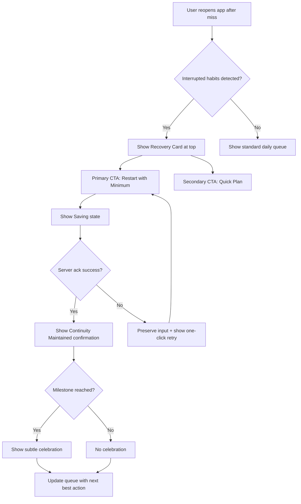
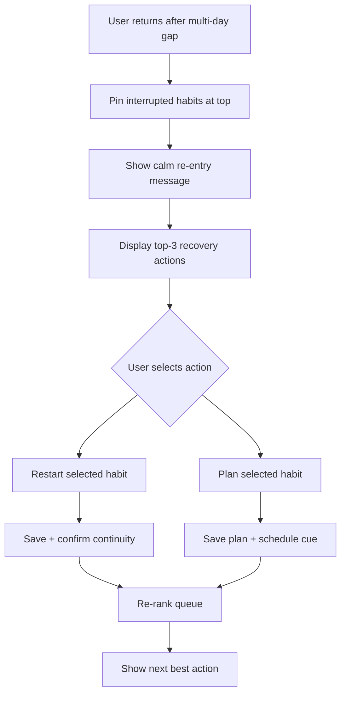
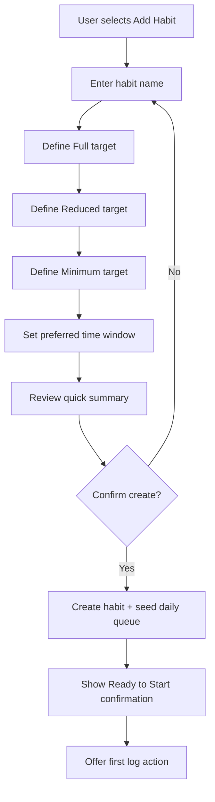

# UX Design Specification bmad-method-practice

**Author:** Kevin
**Date:** 2026-04-26

---

<!-- UX design content will be appended sequentially through collaborative workflow steps -->

## Executive Summary

### Project Vision

HabitFlow is a recovery-first habit tracker designed to help users restart quickly after interruptions rather than feel punished for missed days. The core UX promise is that when a user misses a habit, the product immediately offers a low-friction comeback path and preserves continuity through tiered completion choices.

### Target Users

Primary users are people with variable schedules who struggle with streak-first apps because interruptions often lead to guilt and abandonment. Initial users are Kevin and a small friend cohort for directional validation, with usage spanning both mobile-width and desktop-width web contexts.

### Key Design Challenges

- Designing a post-miss experience that is immediate and actionable, never a dead-end.
- Preserving speed and clarity so daily core actions stay under 10 seconds.
- Maintaining supportive, non-judgmental status language consistently across all key flows.
- Balancing continuity support (minimum completion) with meaningful progress over time.

### Design Opportunities

- Differentiate with an exceptional comeback interaction that turns interruption into momentum.
- Use queue prioritization to reduce decision fatigue and guide users to the next best action.
- Make fallback completion feel legitimate and confidence-building, not like a workaround.
- Create emotionally safe microcopy patterns that improve retention at high-risk moments.

## Core User Experience

### Defining Experience

HabitFlow’s core experience is a recovery-first daily loop centered on one primary action: a rapid restart check-in after interruption. The product should make it effortless for users to log today’s status (full, reduced, minimum, or interrupted) and immediately take the next best action without friction. The defining value moment is not streak perfection; it is fast continuity recovery with a core action target of under 10 seconds median and a full successful restart session target of under 30 seconds.

### Platform Strategy

v1 is desktop-first in presentation and optimization. The experience should be optimized for mouse/keyboard interaction and clear information density on desktop browsers while preserving functional support across mobile-width, tablet-width, and desktop-width layouts. v1 is always-online; no offline-first behavior is required in this phase.

### Effortless Interactions

The following interactions must feel nearly automatic:

- One-click (or single-key) restart check-in after a missed day.
- Immediate post-action queue refresh with clear “what next” guidance.
- Prefilled recovery card with today’s minimum viable action.
- Fast status logging path with minimal cognitive load and no extra screens.

The target is that users can complete the core action (open app → log outcome) in under 10 seconds median and complete a full interruption-to-restart session in under 30 seconds for successful flows.

### Critical Success Moments

- User returns after a missed day and sees an immediate, supportive Recovery Card.
- User completes “Restart Now” quickly and sees continuity preserved.
- User receives explicit save confirmation and accurate updated progress state.
- User leaves the session knowing exactly what to do next.

These moments determine whether users feel supported and stay engaged.

### Experience Principles

1. Recovery-first, always: interruption must always lead to a valid next step.
2. One primary action: prioritize restart/check-in over secondary features.
3. Desktop clarity and speed: optimize for keyboard/mouse efficiency in v1.
4. Trust through correctness: never show success unless persistence is confirmed.
5. Non-judgmental guidance: language must support re-engagement, not shame.
6. Actionable immediacy: every state should answer “what should I do next?”

## Desired Emotional Response

### Primary Emotional Goals

HabitFlow should make users feel safe to restart, supported without judgment, and in control of what to do next. The primary emotional goal is to replace post-miss guilt with immediate agency: “I can recover right now.” Trust is the key referral emotion — users should feel the app protects their progress and responds reliably at vulnerable moments.

### Emotional Journey Mapping

- After a miss + reopen: Relief and safety (“I’m not punished; I can recover now”).
- During core recovery action: Clarity and confidence (“One clear next step, no friction”).
- After restart completion: Renewed momentum and regained control (“I’m back on track”).
- If an error occurs: Calm and reassurance (“My progress is protected; I know exactly what to do next”).
- On return sessions: Steady confidence and consistency (“This app has my back every time”).

### Micro-Emotions

Critical micro-emotions to reinforce:

- Safety over shame
- Confidence over confusion
- Trust over skepticism
- Momentum over discouragement
- Control over helplessness

Critical negative micro-emotions to prevent:

- Guilt/shame after interruption
- Anxiety from unclear save/state status
- Helplessness from dead-end flows
- Mistrust from incorrect or inconsistent progress state
- Data-loss panic

### Design Implications

- Prioritize one primary restart CTA in post-miss states; reduce competing UI noise until restart is complete.
- Use recovery-first microcopy (supportive, non-judgmental, action-oriented) at all interruption touchpoints.
- Show explicit persistence confidence signals (clear success confirmation, save/sync status, deterministic state updates).
- Ensure error experiences preserve user input and provide one recommended recovery action (retry path with reassurance).
- Keep the interruption-to-restart path fast and cognitively light, with immediate “what next” guidance after action.

### Emotional Design Principles

1. Design for emotional recovery first, performance metrics second.
2. Every interruption state must restore agency within one interaction.
3. Trust is built through correctness, transparency, and predictable feedback.
4. Language must never moralize behavior; it should guide re-engagement.
5. Error states must preserve calm, continuity, and forward momentum.
6. The product should consistently leave users feeling “supported and back in control.”

## UX Pattern Analysis & Inspiration

### Inspiring Products Analysis

MyFitnessPal solves high-friction logging with quick daily input patterns and immediate progress feedback. It encourages repeat use through clear daily loops and visible continuity, which is highly relevant for HabitFlow’s core daily recovery loop.

Google Health/Fit demonstrates the value of combining manual tracking with connected-device data. It supports broad health context well, but interface depth can become overwhelming for focused habit tasks.

Apple Health provides strong device integration and comprehensive personal metrics. It offers powerful breadth but can feel dense because of many sections, settings, and layered controls.

Across all three products, the most transferable inspiration is flexible input (manual + connected) and strong logging continuity, while the clearest caution is feature/settings overload that increases cognitive load.

### Transferable UX Patterns

#### Input Patterns

- Support both manual entry and connected-source updates.
- Keep manual logging always available as the fastest fallback.

#### Interaction Patterns

- Prioritize a single daily primary action over secondary workflows.
- Show immediate confirmation and updated status after each action.

#### Information Hierarchy Patterns

- Surface “today + next best action” first.
- Defer advanced controls and detailed settings through progressive disclosure.

### Anti-Patterns to Avoid

- Feature-heavy home screens that compete with the core daily action.
- Large, deeply nested settings exposed too early.
- Multi-step logging flows that add friction to routine actions.
- Dense metric dashboards at the moment users need quick recovery.
- Over-customization requirements before users receive value.

### Design Inspiration Strategy

#### What to Adopt

- Manual + connected tracking flexibility, with manual as first-class.
- Fast daily loop with clear progress confirmation after action.
- Reliable continuity signals that reinforce trust and momentum.

#### What to Adapt

- Keep device integration optional and progressively introduced, not upfront.
- Keep rich analytics available on demand, not dominant in the default view.
- Group settings around minimal defaults first, advanced controls later.

#### What to Avoid

- “Everything visible at once” information architecture.
- Settings-first onboarding or configuration-heavy early experience.
- Any UI pattern that distracts from restart/check-in speed and emotional safety.

## Design System Foundation

### 1.1 Design System Choice

HabitFlow will use a themeable design system built on MUI (Material UI). This approach provides a fast, production-ready component foundation while preserving enough flexibility to create a distinctive recovery-first experience.

### Rationale for Selection

MUI is selected because it best matches HabitFlow’s constraints and goals:

- Supports rapid solo development with robust, well-documented components.
- Enables strong UX consistency and accessibility defaults without building a full custom system.
- Provides theming and component customization to support brand uniqueness.
- Works well with AI-assisted implementation and design iteration workflows.
- Reduces initial design-system overhead while keeping a clear upgrade path for future feature growth.

This is the best fit for balancing speed and uniqueness, with a practical bias toward shipping velocity.

### Direction Implementation Approach

- Start with a minimal MUI component baseline focused on the core daily recovery loop.
- Define a small set of standardized primitives first (buttons, cards, status chips, form controls, alerts, layout containers).
- Keep the first UI surface intentionally narrow: daily queue, recovery card, confirmation states, and error/retry states.
- Use MUI’s accessibility and interaction defaults as the baseline, then iterate on UX tone and hierarchy.
- Delay non-critical component expansion until core recovery KPIs are validated.

### Customization Strategy

- Create a focused custom theme (color tokens, typography scale, spacing system, state semantics) that reflects recovery-first emotional goals.
- Customize key components tied to HabitFlow differentiation:
  - Recovery Card
  - Status/continuity indicators
  - Primary restart CTA and confirmation patterns
- Apply progressive disclosure patterns so advanced settings and integrations do not clutter primary workflows.
- Keep manual logging as first-class UI in v1; treat device integration UI as future-ready extension points behind optional settings.
- Document a lightweight component usage guide to keep AI-generated UI changes consistent over time.

## 2. Core User Experience

### 2.1 Defining Experience

HabitFlow’s defining interaction is rapid recovery re-engagement after interruption. The product should feel easy to use because it brings users back into action immediately, without shame language or decision overload. The signature value is simple: if life disrupts routine, HabitFlow helps users log a recovery action in under 10 seconds median and complete a successful restart session in under 30 seconds.

The phrase users should be able to say to friends is: “I missed a day and got back on track quickly without starting over.”

### 2.2 User Mental Model

Users come in expecting habit tools to track progress and judge consistency. Many are familiar with feature-heavy products that can feel overwhelming after a missed day. Their mental model is:

- I need to know what to do right now.
- I need confirmation my effort still counts.
- I don’t want friction, guilt, or a complex setup moment.

HabitFlow should align to this by prioritizing one clear comeback action and deferring secondary analytics/settings until after re-engagement.

### 2.3 Success Criteria

The defining experience succeeds when users report the app feels easy and supportive, and behavior reflects fast recovery:

- Reopen after interruption immediately surfaces a recovery-first panel/queue state.
- Users can complete restart/check-in in one primary flow with minimal cognitive load.
- Core action path (open app → log outcome) is completed in under 10 seconds median.
- Full interruption-to-restart path is completed in under 30 seconds for successful flows.
- Users receive explicit saved-state confirmation (not ambiguous success).
- Users leave each recovery session with a clear next best action.

### 2.4 Novel UX Patterns

HabitFlow should use mostly familiar interaction patterns (cards, primary CTA, status confirmation, queue ordering), with one distinctive twist: recovery-first prioritization.

Pattern stance:

- Established foundation: familiar controls and information hierarchy reduce learning cost.
- Unique twist: post-miss re-engagement is first-class, not buried in tracking/reporting.
- Emotional differentiation: supportive re-entry language and milestone-based celebration, rather than perfection-centric reinforcement.

### 2.5 Experience Mechanics

1. Initiation

- User reopens after interruption.
- Screen prioritizes a calm, supportive “Welcome back—today is a fresh start” recovery surface.
- Interrupted habits are pinned to the top of the daily queue.

1. Interaction

- One primary action is focused immediately (keyboard/mouse friendly): restart/check-in.
- Secondary action supports quick planning when immediate completion is not possible.
- Manual logging remains first-class and always available.

1. Feedback

- System shows pending state (`Saving…`) then confirmed success after server acknowledgment.
- Confirmation emphasizes continuity and control (for example, “Continuity maintained” with timestamp).
- If save fails, input is preserved and one-click retry is offered.

1. Completion

- On success, users see supportive confirmation plus subtle celebration by default.
- Confetti/balloons are milestone-based only (for meaningful rebound moments), capped for frequency, and disabled when reduced-motion is enabled.
- Queue updates instantly to show next best action, preserving momentum.

1. Guardrails

- No dead-end interruption states.
- No moralized copy (“failed,” “broken”).
- No over-celebration on every routine action.

## Visual Design Foundation

### Color System

Because no existing brand guidelines are defined, HabitFlow will use a Calm Recovery theme direction optimized for emotional safety, trust, and low cognitive load.

Core palette strategy:

- Primary: calm blue for guidance and primary action emphasis.
- Secondary: teal support tones for secondary surfaces and highlights.
- Success/Recovery: gentle green for continuity and progress confirmation.
- Warning: amber for caution states without punitive intensity.
- Error: accessible red used sparingly, paired with supportive copy and recovery actions.
- Neutrals: soft slate-gray scale for readable structure and low visual fatigue.

Semantic mapping priorities:

- Recovery and continuity states must feel supportive, never punitive.
- Celebration colors are reserved for milestone-level re-engagement moments only.
- High-contrast text and status indicators remain the default over decorative effects.

### Typography System

HabitFlow will use an MUI-compatible sans-serif system optimized for desktop readability and quick scanning.

Typography strategy:

- Primary font: Inter (fallback to Roboto and system sans-serif).
- Tone: modern, friendly, clear, and operational.
- Hierarchy: strong heading contrast for rapid orientation, with highly legible body text for action labels and guidance copy.
- Copy style: concise, supportive, and instruction-first in high-risk moments (after interruption and during retries).

Type scale approach (desktop-first):

- Display/hero only where needed for milestone moments.
- H1/H2 for page and section orientation.
- Body and helper text tuned for dense-but-calm decision spaces (queue, recovery card, status feedback).

### Spacing & Layout Foundation

HabitFlow will use a structured, moderate-air spacing approach to balance clarity with speed.

Layout strategy:

- Base spacing unit: 8px rhythm (with 4px micro-adjustments).
- Card-first composition for recovery panel, queue rows, and confirmation surfaces.
- Desktop-first content width and hierarchy to minimize scanning effort.
- One-primary-action visual priority per state, with secondary actions clearly subordinate.

Density principles:

- Keep the default view focused on today + next best action.
- Defer analytics depth and settings complexity until after primary action completion.
- Maintain stable spatial patterns across states so users build muscle memory.

### Accessibility Considerations

Visual and interaction accessibility is mandatory in the foundation:

- WCAG-aligned color contrast for all critical text and status combinations.
- Reduced-motion support for celebration and transition effects.
- Do not use color alone to convey status; pair with clear labels and iconography.
- Keyboard-first focus visibility for primary recovery actions.
- Error and warning visuals must preserve calm tone and provide immediate next steps.

## Design Direction Decision

### Design Directions Explored

Eight established design constraints (recovery-first, desktop-first, MUI foundation, low cognitive load, milestone-only celebration, and trust-focused feedback) were explored across six visual directions in the design showcase:

- Direction 1: Calm Recovery (soft blue, supportive hierarchy, low-noise recovery focus)
- Direction 2: Focused Momentum (faster visual rhythm and action emphasis)
- Direction 3: Minimal Neutral (utility-first, low decoration)
- Direction 4: Continuity Dashboard (post-action metrics emphasis)
- Direction 5: Warm Encouragement (emotion-forward milestone moments)
- Direction 6: Adaptive Coach (future-facing optional coaching interactions)

The exploration artifact is captured at `_bmad-output/planning-artifacts/ux-design-directions.html`.

### Chosen Direction

Direction 1 — Calm Recovery is selected as the primary design direction.

This direction best matches HabitFlow’s defining interaction: immediate, supportive re-engagement after interruption with one clear next action. It also aligns with the desktop-first v1 strategy and the requirement to keep the interface simple, clear, and non-overwhelming.

### Design Rationale

- Supports emotional goals (safe, supported, in control) without visual over-stimulation.
- Keeps recovery actions visually dominant and secondary content de-emphasized.
- Reinforces trust via clear status, readable hierarchy, and calm semantic color usage.
- Reduces risk of feature bloat by preserving a focused, card-first action surface.
- Provides a durable base that can absorb selective elements from other directions later (e.g., stronger action emphasis or post-action insight density) without changing the core tone.

### Implementation Approach

- Use Direction 1 as the baseline for all primary recovery flows in v1.
- Implement recovery card, queue rows, and confirmation states using MUI components and the Calm Recovery token set.
- Keep celebration effects subtle by default; reserve confetti/balloons for milestone re-engagement only.
- Apply progressive disclosure for advanced metrics/settings to preserve a low-noise first screen.
- Validate with usability checks against core criteria: restart clarity, completion speed, and confidence in saved state.

## User Journey Flows

### Journey 1 — First-Miss Rapid Recovery

Primary goal: user misses a day, reopens HabitFlow, logs a recovery action in under 10 seconds median, and completes a successful restart session in under 30 seconds.

Key UX notes:

- Recovery action is always visible and first in hierarchy.
- No dead-end states; every failure path returns to recoverable action.
- Confirmation prioritizes trust (saved + continuity status).

### Journey 2 — Multi-Day Re-Entry

Primary goal: user returns after several missed days and re-engages without shame or overload.

Key UX notes:

- Progressive disclosure prevents overwhelm (top-3 first, then show more).
- Re-entry language remains supportive and non-judgmental.
- System emphasizes immediate progress over historical penalty framing.

### Journey 3 — New Habit Setup with Tiered Completion

Primary goal: user creates a habit quickly with full/reduced/minimum tiers and immediate readiness for recovery-first tracking.

Key UX notes:

- Setup stays short and guided for solo users under time pressure.
- Tier model is explicit at creation to support recovery by design.
- Immediate post-create action keeps momentum high.

### Journey Patterns

- Navigation pattern: action-first cards with one dominant CTA and one supportive secondary action.
- Decision pattern: simple binary branches (restart now vs plan) to reduce cognitive load.
- Feedback pattern: pending save state, explicit success confirmation, recoverable error handling.
- Prioritization pattern: interrupted or at-risk habits float to top; secondary info deferred.

### Flow Optimization Principles

- Minimize steps to value in the first 30 seconds after reopen.
- Keep one-primary-action hierarchy across all critical states.
- Preserve user input on failure and provide one-click retry.
- Use milestone celebration selectively; avoid constant reward noise.
- Favor familiar controls and predictable layouts over novel mechanics.

## Component Strategy

### Design System Components

Using MUI as the foundation, HabitFlow will rely on standard components for core structure and interaction speed.

Primary MUI foundation components:

- Layout: Container, Box, Stack, Grid
- Navigation/structure: AppBar, Drawer (if needed), Tabs (limited use)
- Inputs: TextField, Select, Checkbox, Switch, Button, IconButton
- Feedback/status: Alert, Snackbar, Chip, LinearProgress, CircularProgress
- Surfaces: Card, Paper, Divider, Dialog, Menu, Tooltip
- Data display: List, ListItem, Badge, Typography

Coverage assessment:

- MUI fully covers generic UI primitives, forms, dialogs, and status surfaces.
- Custom work is needed for recovery-specific orchestration, milestone logic, and queue prioritization presentation.

### Custom Components

#### RecoveryCard

**Purpose:** Primary post-interruption action surface that restores momentum quickly.  
**Usage:** Top of daily view when interruption context is detected.  
**Anatomy:** Title, supportive message, primary CTA, secondary CTA, optional milestone badge, save status row.  
**States:** default, focused, saving, success, error-retry, milestone.  
**Variants:** compact (queue-inline), expanded (top panel).  
**Accessibility:** ARIA-labelled region, keyboard-first CTA focus, live region for save/result messages.  
**Content Guidelines:** supportive non-judgmental microcopy; no punitive language.  
**Interaction Behavior:** primary action starts immediate restart flow; secondary opens quick plan.

#### RecoveryQueuePanel

**Purpose:** Prioritized list of interrupted/at-risk habits with next best actions.  
**Usage:** Daily dashboard core section.  
**Anatomy:** Section header, top-3 items, show-more control, per-row action CTA.  
**States:** empty, top-3 default, expanded, loading, error.  
**Variants:** compact desktop panel, full-page section.  
**Accessibility:** list semantics, keyboard row navigation, clear action labels.  
**Interaction Behavior:** selecting row triggers inline action or opens RecoveryCard context.

#### ContinuityStatusPill

**Purpose:** Compact continuity confidence indicator after actions.  
**Usage:** Queue rows, confirmation surfaces, summary cards.  
**Anatomy:** status icon, text label, timestamp tooltip/inline detail.  
**States:** maintained, pending, warning, failed.  
**Variants:** inline chip, prominent badge.  
**Accessibility:** text always accompanies color state.  
**Interaction Behavior:** optional hover/focus detail reveal.

#### MilestoneCelebrationLayer

**Purpose:** Controlled milestone celebration (confetti/balloons) for meaningful rebound moments only.  
**Usage:** Triggered on milestone events (not routine logs).  
**Anatomy:** subtle animation layer, congratulatory message, dismiss action.  
**States:** inactive, active, reduced-motion fallback.  
**Variants:** confetti, balloon accent, static badge fallback.  
**Accessibility:** disabled/toned down with reduced-motion; announcements concise.  
**Interaction Behavior:** auto-timeout + manual dismiss; never blocks core flow.

#### SaveStateBanner

**Purpose:** Explicit trust signal for persistence outcomes.  
**Usage:** Immediately after restart/check-in actions.  
**Anatomy:** state text (`Saving…`, `Saved`, `Retry`), timestamp, retry control.  
**States:** pending, success, failure-retry.  
**Variants:** inline row, top banner.  
**Accessibility:** ARIA live polite/assertive depending on state severity.  
**Interaction Behavior:** retry preserves prior input payload.

### Component Implementation Strategy

- Build custom components on top of MUI tokens and primitives only.
- Keep all recovery-critical interactions in a shared `recovery` component package/module.
- Enforce consistent state contracts across components (`pending/success/error/retry`).
- Standardize content patterns (supportive language, explicit next action, clear save state).
- Validate keyboard and reduced-motion behavior as first-class acceptance criteria.

### Implementation Roadmap

#### Phase 1 — Core Flow Components (MVP Critical)

- RecoveryCard
- RecoveryQueuePanel
- SaveStateBanner
- ContinuityStatusPill

#### Phase 2 — Experience Quality Components

- MilestoneCelebrationLayer
- Reusable empty/error state wrappers for recovery surfaces

#### Phase 3 — Future Extensions

- Device integration status components
- Adaptive coaching suggestion cards (preview-and-apply pattern)

## UX Consistency Patterns

### Button Hierarchy

- Primary buttons are reserved for the single highest-value action in a state (for example, `Restart with Minimum`).
- Secondary buttons support alternatives (for example, `Quick Plan`, `Show More`) and remain visually subordinate.
- Tertiary/text actions handle low-risk utility tasks (dismiss, learn more, optional preferences).
- Never present two equal-weight primary CTAs in the same recovery context.
- Primary actions must remain keyboard-focus visible and reachable first in critical flows.

### Feedback Patterns

- Pending: explicit save-in-progress signal (`Saving…`) near action context.
- Success: calm confirmation with continuity meaning and optional timestamp (`Continuity maintained`).
- Warning: amber-toned caution with clear next step.
- Error: non-punitive copy, preserved input, and one-click retry.
- Celebration: subtle by default; milestone-only confetti/balloons with reduced-motion compliance.

### Form Patterns

- Keep forms short and action-oriented, especially in recovery and setup flows.
- Validate inline and early, with concise correction guidance.
- Preserve entered values across failures whenever possible.
- Use progressive disclosure for advanced options and settings.
- Required fields must be clearly marked with accessible labels and helper text.

### Navigation Patterns

- Dashboard defaults to today + next best action with interrupted habits prioritized.
- Use card-first sections with stable spatial placement for muscle memory.
- Defer deep analytics/settings until after primary daily action completion.
- For multi-step flows, show lightweight progress cues and clear back paths.
- Avoid navigation structures that compete with the primary recovery action.

### Additional Patterns

#### Modal & Overlay Patterns

- Use modals only for high-consequence confirmations or focused tasks.
- Prefer inline recovery surfaces over blocking overlays when possible.
- Every modal includes clear primary action, cancel path, and escape behavior.

#### Empty, Loading, and Error States

- Empty states provide a direct next action, not just explanation text.
- Loading states preserve layout stability and reduce visual jitter.
- Error states pair cause context with an immediate recovery action.

#### Search/Filter Patterns

- Keep filtering lightweight and optional in v1.
- Use progressive enhancement: quick filters first, advanced filters later.
- Preserve filter state during session navigation for continuity.

## Responsive Design & Accessibility

### Responsive Strategy

HabitFlow follows a desktop-first strategy for v1 while preserving functional responsiveness across tablet and mobile widths.

**Desktop (primary target):**

- Use wider layouts to prioritize recovery card + ranked queue visibility.
- Keep one-primary-action hierarchy strong in all critical states.
- Use side-by-side information only when it improves decision speed and does not dilute recovery focus.

**Tablet (secondary):**

- Collapse to simplified stacked layouts with touch-friendly spacing.
- Keep recovery actions top-priority and visible without deep scrolling.
- Maintain the same mental model and action order as desktop.

**Mobile (deferred optimization, functional support required):**

- Preserve core flow reliability (reopen → recover → confirm → next action).
- Collapse non-critical panels behind progressive disclosure.
- Keep primary CTA and save-state feedback immediately visible above fold when possible.

### Breakpoint Strategy

Use standard MUI-aligned breakpoints with desktop-first implementation logic:

- Mobile: 320–767px
- Tablet: 768–1023px
- Desktop: 1024px+
- Large desktop: 1280px+ (optional density improvements only)

Breakpoint behavior principles:

- Do not change core interaction sequence across breakpoints.
- Prioritize content reflow over feature expansion on larger screens.
- Ensure interrupted-habit recovery affordances remain visually dominant at every width.

### Accessibility Strategy

Target WCAG 2.1 AA as the baseline compliance level for v1.

Core accessibility requirements:

- Color contrast meeting AA thresholds for all primary text/status surfaces.
- Full keyboard operability for recovery-critical actions.
- Semantic structure and ARIA support for dynamic status updates.
- Reduced-motion support for celebration and transitions.
- Touch targets meeting minimum size guidance for touch contexts.
- No color-only status communication; always pair with text/icon signals.

### Testing Strategy

#### Responsive testing

- Verify key flows at representative widths (mobile, tablet, desktop, large desktop).
- Cross-browser checks on Chrome, Safari, Firefox, and Edge.
- Validate layout stability and interaction timing under normal and slower network conditions.

#### Accessibility testing

- Automated checks (axe/Lighthouse or equivalent) in CI and local QA.
- Keyboard-only navigation testing for all core journeys.
- Screen reader smoke tests (VoiceOver on macOS at minimum for v1).
- Reduced-motion and high-contrast scenario verification.

#### Journey-level validation

- Test first-miss recovery, multi-day re-entry, and new habit setup at each major breakpoint.
- Confirm save-state messaging is announced and visually clear in all success/failure branches.

### Implementation Guidelines

- Use responsive tokens and MUI breakpoints rather than ad-hoc viewport hacks.
- Favor relative sizing and flexible layout primitives (`Stack`, `Grid`, `Box`) over fixed dimensions.
- Keep primary CTA placement and interaction order consistent across device classes.
- Implement ARIA live regions for save-state and continuity confirmations.
- Ensure focus order is predictable after async actions and errors.
- Preserve user input on failure and route users to one-click recovery paths.
